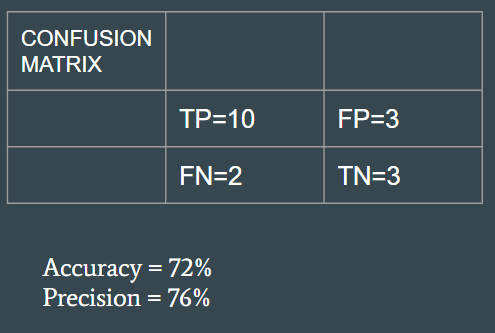

# Play Detection and Ball Tracking

EyeBall is the play-detection and ball-tracking subsystem of Muse. It detects the basketball in video, stitches per-frame detections into a smoothed trajectory, and derives higher-level play-level events (passes, possession boundaries, play state) that feed downstream analytics and production applications.

## Motivation

Box-score statistics undervalue most of what happens in a basketball game. Shooting percentages and assist counts are lossy summaries of trajectory and motion data that — if extracted directly from video — could answer richer questions: how possessions start and end, which plays work and which don't, when the ball changes hands and why. EyeBall exists to make that trajectory and motion data first-class.

The forward focus is **play detection and tracking**:

- **Tracking** — a continuous, occlusion-tolerant trajectory of the ball throughout a game.
- **Pass detection** — already shipped; sharp directional changes in the trajectory are labelled as passes.
- **Possession boundaries** — segmenting a game into coherent possessions from trajectory structure.
- **Play state** — classifying frames as static play, transition, out-of-bounds, or not-playing.
- **Shot and shot-attempt detection** — eventual; a trajectory primitive on top of the above.
- **Highlight detection** — timestamping moments of interest from play state + trajectory, for automated reel generation.

## Downstream products

EyeBall's primitives are designed to feed a broader product surface for amateur and semi-pro basketball — the audience that has no cost-effective access to professional-grade broadcasting or recruitment-ready footage today:

- **Automated broadcasting.** Virtual panning of a panoramic camera feed, livestreamed to YouTube/RTMP. See [`docs/broadcast.md`](docs/broadcast.md) for the design of this path and the constraints it imposes on the pipeline.
- **Recruitment-ready game film and skill clips.** Broadcast-quality footage clipped around highlights, tied to a player's online profile, shareable with scouts and programs (especially valuable for international amateur players who otherwise struggle to reach US programs).
- **Play-by-play analytics.** Structured possession and play-state outputs that feed coaching, scouting, and training workflows.

Each of these products consumes EyeBall's primitives rather than rebuilding them.

## Pipeline

```
video → vid_crop.py          (crop / pre-process frames)
      → yolo_detection.py    (detect ball bounding box per frame)
      → KalmanFilter.py      (smooth and predict trajectory)
      → track_ball.py        (orchestrate + emit trajectory + events)
```

## Methods

**Detection.** YOLOv3 per frame. Robust to the dominant failure modes (colour confusion with court surfaces, partial occlusion, motion blur) that defeat classical colour/contour pipelines. Detailed rationale and the methods rejected along the way are in [`docs/detection.md`](docs/detection.md). Setup instructions live in [`yolo_detection.md`](yolo_detection.md).

**Tracking.** `KalmanFilter.py` fuses per-frame detections into a single trajectory. The filter:

- predicts the next ball position from prior positions,
- gates candidate detections by distance from the prediction (rejects ball-coloured distractors),
- tolerates a bounded run of missed detections before terminating the track — absorbs brief occlusions without fragmenting the trajectory.

**Pass detection.** Over a short rolling window of trajectory points, the pipeline computes the angle between successive motion vectors. A sharp directional change in the 0–60° or 300–360° band, paired with low vertical displacement over the preceding ~10 frames and a cooldown of 30 frames since the last pass, is labelled a pass. Thresholds are dataset-dependent and live at the top of `track_ball.py`.

**Play-level segmentation.** Scoped as forward work — see **Roadmap**.

**Dataset.** Live broadcast footage is currently too noisy end-to-end (cut-aways, zooms, camera moves). Development uses stable broadcast-angle video as a clean surrogate for a single-panoramic-camera setup. Moving to real-world panoramic input is on the roadmap.

## Modules

| File | Role |
|---|---|
| `track_ball.py` | Entry point. Runs the detect + filter loop and writes the annotated video. |
| `yolo_detection.py` | YOLO wrapper. Exposes `save_tagged_frames` and `create_tagged_video`. |
| `KalmanFilter.py` | Standalone `KalmanFilter`, `Track`, `Tracker` classes. |
| `vid_crop.py` | Frame cropping and pre-processing, plus playground-polygon utilities built on `shapely`. |
| `movement_cropped.ipynb`, `movement_heatmap.ipynb` | Exploratory notebooks; not part of the main pipeline. |
| `assets/` | Logo and README figures. |
| `docs/` | Design rationale for detection and the broadcasting application. |

## Run

```bash
python3 EyeBall/track_ball.py
```

Paths, colour thresholds, and area bounds are hard-coded near the top of `track_ball.py` — edit them before running on a new video. Promoting these to a config file is on the roadmap.

## Evaluation

Pass-detection accuracy on held-out broadcast-angle clips:



Example trajectory visualisation:


## Roadmap

- **Play-level segmentation.** Extend the per-frame pipeline to emit possession boundaries and play state (static / transition / out-of-bounds / not-playing). This is the primary forward direction.
- **Shot and shot-attempt detection.** On top of play state — classify the end of a possession.
- **Highlight detection.** Timestamp moments of interest from trajectory + play state, to drive automated reel/skill-clip generation.
- **Isolated detector evaluation.** Precision/recall per frame against a labelled clip set, so detector changes can be measured without the full pipeline.
- **Config surface.** Move paths, thresholds, and region-of-interest bounds out of source into a config file.
- **Real panoramic input.** Evaluate on real-world panoramic broadcast footage rather than only broadcast-angle capture.
- **Typed data product.** Expose the trajectory and derived events with a stable schema so FollowThrough, a future broadcasting module, or any downstream subsystem can consume them without knowing EyeBall internals.
- **Test suite.** Currently none.

## Design docs

- [`docs/detection.md`](docs/detection.md) — ball-detector method rationale and what was rejected along the way
- [`docs/broadcast.md`](docs/broadcast.md) — broadcasting as a downstream application; the constraints it imposes on EyeBall's public surface
