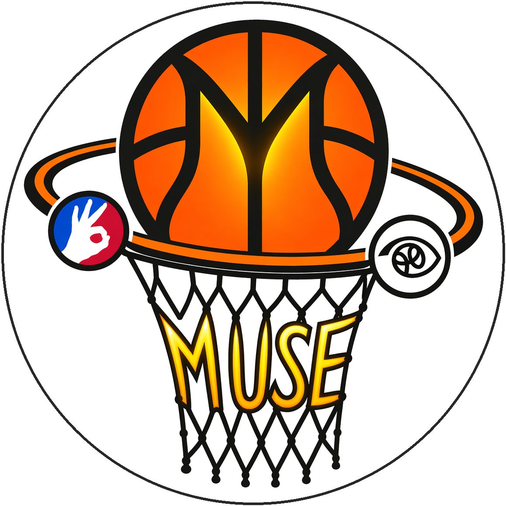

<p align="center">
  
</p>

<h1 align="center">Muse</h1>

A computer-vision and sports-analytics system for basketball. Muse consolidates the technical substrate for a set of products that aim to **bridge the gap between the eye-test and counting stats** -- for coaching, scouting, and training.

## Motivation

Basketball analysis has two traditions. The **eye-test** -- watching games to judge plays and players -- is rich but expensive and subjective. **Counting stats** -- points, assists, shooting percentages -- are cheap and comparable but lossy. Most of what happens in a possession never reaches the box score, yet that's where evaluations and coaching decisions get anchored.

Computer vision makes the eye-test computable. From raw game video, Muse extracts:

- **Where the ball goes** -- a continuous trajectory that makes possessions, passes, and shot attempts first-class events rather than summarised counts.
- **How a shot is formed** -- a jumpshot reduced to a vector of joint positions over time, directly comparable to reference-player templates.

Downstream products -- automated broadcasting for amateur leagues, shot-form coaching apps, play-by-play analytics, recruitment-ready game film -- consume those primitives.

## Subsystems

| Subsystem | What it does | Core stack |
|---|---|---|
| [`EyeBall/`](EyeBall/) | Play detection and ball tracking: trajectory, passes, possession boundaries, play state | YOLO detection + Kalman filter |
| [`FollowThrough/`](FollowThrough/) | Shooting-form pose analysis: jumpshot reduced to joint-vector template, compared against reference-player templates | MediaPipe Pose + Savitzky--Golay smoothing |

Each subsystem has its own README with design docs under `<subsystem>/docs/`.

The subsystems run independently today. Unifying their IO -- a shared typed trajectory/pose data product -- is on the roadmap.

## Requirements

- Python 3.12
- OpenCV 4.10, MediaPipe, NumPy, SciPy, Pandas, Shapely, imutils

`requirements.txt` at the repo root lists the top-level dependencies. The EyeBall YOLO path additionally requires a local [PyTorch-YOLOv3](https://github.com/eriklindernoren/PyTorch-YOLOv3) checkout -- see [`EyeBall/yolo_detection.md`](EyeBall/yolo_detection.md).

See each subsystem's README for its own entry points, methods, and status.

## Repository layout

```
Muse/
├── EyeBall/              # Play detection and ball tracking
│   ├── assets/           # README figures
│   └── docs/             # Detection rationale, broadcasting application
├── FollowThrough/        # Pose / shot-form analysis
│   ├── source/           # Canonical implementation (OOP, MediaPipe Pose)
│   └── docs/             # Reserved for subsystem design docs
├── README.md
└── requirements.txt
```

## Status

Active development on `main`. Long-running solo project -- no release cadence, no external contributors.
